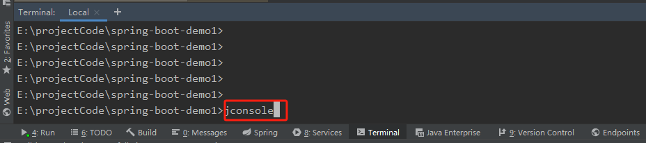
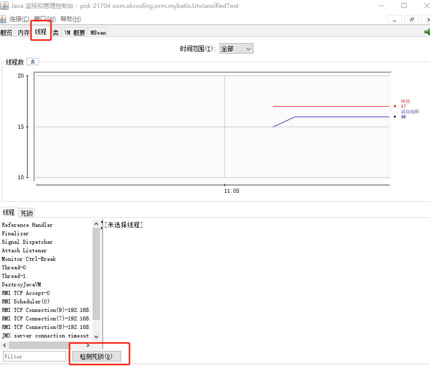

##### 产生死锁的四个必要条件：

1. 互斥使用：当资源被一个线程使用或占用时，其他线程不能进行使用。
2. 不可抢占：想获取资源的那一方不能从正在使用资源的一方抢占资源，只有正在使用资源的一方主动释放才能进行获取。
3. 请求和保持：资源请求者在请求其他资源时，保持对现占资源的占有。
4. 循环等待：p1占有p2的资源，p2占有p1的资源，形成一个等待环路。

```java
public class DeadLock {
        Object lock1 = new Object();
        Object lock2 = new Object();
        Thread t1 = new Thread(() -> {
            try {
                synchronized (lock1){
                    Thread.sleep(1000);
                    synchronized (lock2){
                        System.out.println("输出t1");
                    }
                }
            } catch (InterruptedException e) {
                e.printStackTrace();
            }
        });
        Thread t2 = new Thread(() -> {
            try {
                synchronized (lock2){
                    Thread.sleep(1000);
                    synchronized (lock1){
                        System.out.println("输出t2");
                    }
                }
            } catch (InterruptedException e) {
                e.printStackTrace();
            }
        });
        t1.start();
        t2.start();
}
```

如果没有`Thread.sleep(1000)`，则可能t1先锁lock1、lock2，然后释放lock2、lock1，这时t2就可以正常执行。

但是因为有t1、t2线程休眠1s，所以就会导致执行顺序：t1锁lock1，t2锁lock2，导致t1使用lock2时由于t2的占用而等待，t2使用lock1时由于t1的占用而等待，从而导致死锁。


##### 使用IDEA查看程序是否产生死锁



打开监管台后选择对应的类后选择线程，检测死锁即可
