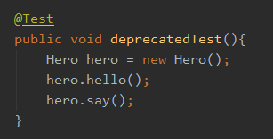
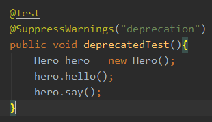

### 注解的定义

Java 注解用于为 Java 代码提供元数据。作为元数据，注解不直接影响你的代码执行，但也有一些类型的注解实际上可以用于这一目的。Java 注解是从 Java5 开始添加到 Java 的。

可以简单把注解理解为`标签`，注解的使用就是定义好标签然后贴到需要贴的事物上。

```java
public @interface TestAnnotation {
}
```

类似于接口的定义，只是interface关键字前加上@

### 注解的运用

```java
@TestAnnotation
public class Test {
}
```

你可以简单理解为将 `TestAnnotation` 这张标签贴到 Test 这个类上面

### 元注解

元注解就是基本注解，可以注解到其他注解上

元标签有 @Retention、@Target、@Documented、@Inherited、@Repeatable 5 种。

#### @Retention

Retention的中文意思是保留期，@Retention使用于注解上是用于解释该注解的生命周期

| 参数                      | 解释                                                         |
| ------------------------- | ------------------------------------------------------------ |
| `RetentionPolicy.SOURCE`  | 注解只在源码阶段保留，在编译器进行编译时它将被丢弃忽视       |
| `RetentionPolicy.CLASS`   | 注解只被保留到编译进行的时候，它并不会被加载到 JVM 中        |
| `RetentionPolicy.RUNTIME` | 注解可以保留到程序运行的时候，它会被加载进入到 JVM 中，所以在程序运行时可以获取到它们 |

```java
@Retention(RetentionPolicy.RUNTIME)
public @interface TestAnnotation {
}
```


#### @Target

| 参数                          | 解释                                       |
| ----------------------------- | ------------------------------------------ |
| `ElementType.ANNOTATION_TYPE` | 可以给一个注解进行注解                     |
| `ElementType.CONSTRUCTOR`     | 可以给构造方法进行注解                     |
| `ElementType.FIELD`           | 可以给属性进行注解                         |
| `ElementType.LOCAL_VARIABLE`  | 可以给局部变量进行注解                     |
| `ElementType.METHOD`          | 可以给方法进行注解                         |
| `ElementType.PACKAGE`         | 可以给一个包进行注解                       |
| `ElementType.PARAMETER`       | 可以给一个方法内的参数进行注解             |
| `ElementType.TYPE`            | 可以给一个类型进行注解，比如类、接口、枚举 |

#### @Documented

顾名思义，这个元注解肯定是和文档有关。它的作用是能够将注解中的元素包含到 Javadoc 中去。

#### @Inherited

如果一个超类被 @Inherited 注解过的注解进行注解的话，那么如果它的子类没有被任何注解应用的话，那么这个子类就继承了超类的注解。 

```java
@Inherited
@Retention(RetentionPolicy.RUNTIME)
@interface Test {}

@Test
public class A {}
public class B extends A {}
```

注解 Test 被 @Inherited 修饰，之后类 A 被 Test 注解，类 B 继承 A,类 B 也拥有 Test 这个注解。

#### @Repeatable

@Repeatable 是 Java 1.8 才加进来的，所以算是一个新的特性。

```java
@interface Persons {
    Person[]  value();
}

@Repeatable(Persons.class)
@interface Person{
    String role default "";
}

@Person(role="artist")
@Person(role="coder")
@Person(role="PM")
public class SuperMan{
}
```

### 注解的属性

#### 定义一个注解，有多个属性时:

```java
@Target(ElementType.TYPE)
@Retention(RetentionPolicy.RUNTIME)
public @interface TestAnnotation {
    public int id() default -1;
    public String msg() default "Hi";
}
```

使用：

```java
@TestAnnotation(id=3,msg="hello annotation")
public class Test {
}
```

因为都有默认值，所以这么使用时：

```Java
@TestAnnotation()
public class Test {}
```

变量按照默认值进行使用

#### 定义注解只有一个属性

```Java
public @interface Check {
    String value();
}
```

此时对注解进行使用两者是等价的：

```Java
@Check("hi")
int a;
```

```java
@Check(value="hi")
int a;
```

#### 定义注解没有属性

```java
public @interface Perform {}
```

```java
@Perform
public void testMethod(){}
```

### 预置注解

#### @Deprecated

编译器在编译阶段遇到这个注解时会发出提醒警告，告诉开发者正在调用一个过时的元素比如过时的方法、过时的类、过时的成员变量。

```java
public class Hero {
    @Deprecated
    public void hello(){
        System.out.println("hello");
    }
    
    public void say(){
        System.out.println("nothingToSay");
    }
}
```



#### @Override

表示重写父类方法

#### @SuppressWarnings

阻止警告的意思。之前说过调用被 @Deprecated 注解的方法后，编译器会警告提醒，而有时候开发者会忽略这种警告，他们可以在调用的地方通过 @SuppressWarnings 达到目的。



#### @SafeVarargs

目的是提醒开发者不要用参数做一些不安全的操作,它的存在会阻止编译器产生 unchecked 这样的警告。

#### @FunctionalInterface

我们进行线程开发中常用的 Runnable 就是一个典型的函数式接口，上面源码可以看到它就被 @FunctionalInterface 注解。

可能有人会疑惑，函数式接口标记有什么用，这个原因是函数式接口可以很容易转换为 Lambda 表达式。

### 注解的提取

注解通过反射获取。首先可以通过 Class 对象的 isAnnotationPresent() 方法判断它是否应用了某个注解。


