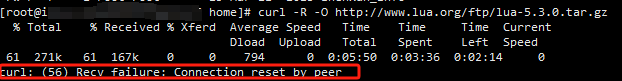
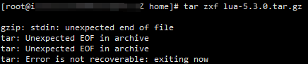
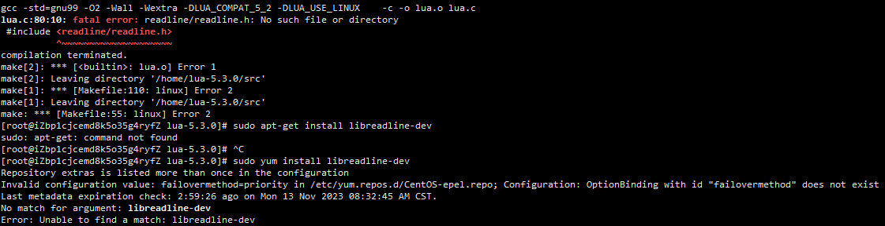

##### Linux 系统上安装lua

```shell
curl -R -O http://www.lua.org/ftp/lua-5.3.0.tar.gz
tar zxf lua-5.3.0.tar.gz
cd lua-5.3.0
make linux test
make install
```

接下来我们创建一个 `HelloWorld.lua` 文件，代码如下:

```lua
print("Hello World!")
```

执行以下命令:

```shell
$ lua HelloWorld.lua
```

输出结果为：

```shell
Hello World!
```

##### 安装过程中可能会出现的问题

###### 1.下载失败

```shell
curl -R -O http://www.lua.org/ftp/lua-5.3.0.tar.gz
```



下载失败需要删掉文件重新下载

###### 2. 解压失败

```shell
tar zxf lua-5.3.0.tar.gz
```



压缩文件不完整，需要将压缩文件删掉重新下载

###### 3.make linux test失败

```shell
make linux test
```



控制台会打印一堆日志，错误原因是readline未安装

```
yum和apt-get的区别：
一般来说著名的linux系统基本上分两大类： 
1.RedHat系列：Redhat、Centos、Fedora等 
2.Debian系列：Debian、Ubuntu等 

RedHat 系列 
1 常见的安装包格式 rpm包,安装rpm包的命令是“rpm -参数” 
2 包管理工具 yum 
3 支持tar包 
Debian系列 
1 常见的安装包格式 deb包,安装deb包的命令是“dpkg -参数” 
2 包管理工具 apt-get 
3 支持tar包
```

如果Linux是Debian系列：`sudo apt-get install libreadline-dev`

如果Linux是RedHat系列：`yum install readline-devel`

