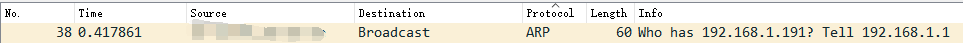
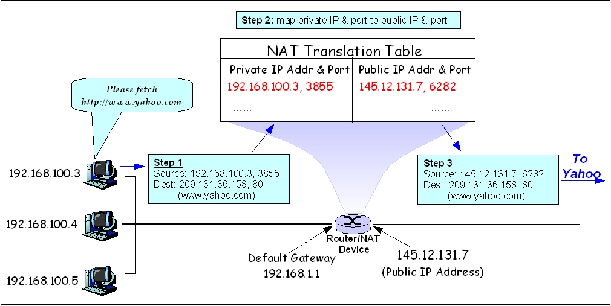

### 互联网五层模型

中文名词翻译有差别，比如实体层一般都是叫做物理层，连接层叫做链路层

#### 各层的相关协议

##### 实体层

##### 链路层

**①以太网协议**：以太网规定一组电信号构成一个数据包，叫做`帧(Frame)`每一帧分为两部分：标头和数据(Data)

"标头"包含数据包的一些说明项，比如发送者、接受者、数据类型等等；"数据"则是数据包的具体内容。

"标头"的长度，固定为18字节。"数据"的长度，最短为46字节，最长为**1500字节**。因此，整个"帧"最短为64字节，最长为1518字节。如果数据很长，就必须分割成多个帧进行发送。

##### 网络层

**①ARP协议（Address Resolution Protocol）**

每个网关都有一个出厂即固定且唯一的MAC地址，那么是如何知道另一块网卡的MAC地址呢，就是需要ARP协议。

ARP即地址解析协议， 用于实现从 IP 地址到 MAC 地址的映射，即询问目标IP对应的MAC地址。

在网络通信中，主机和主机通信的数据包需要依据OSI模型从上到下进行数据封装，当数据封装完整后，再向外发出。所以在局域网的通信中，不仅需要源目IP地址的封装，也需要源目MAC的封装。

一般情况下，上层应用程序更多关心IP地址而不关心MAC地址，所以需要通过ARP协议来获知目的主机的MAC地址，完成数据封装。

就像上图看出，发送的目标是`广播`，所有子网下的主机都会收到，主机拿到数据包后用其中的IP和自己的IP进行比较，如果相同则向发送者回复自己的MAC地址

**②IP协议**

规定网络地址的协议，叫做IP协议。它所定义的地址，就被称为IP地址。

### 网关路由器如何将数据包发送到其本地网络中的主机

多亏了[NAT](https://cloud.tencent.com/developer/tools/blog-entry?target=https%3A%2F%2Fen.wikipedia.org%2Fwiki%2FNetwork_address_translation)，多个私有IP地址可以共享一个公网IP。

在[TCP](https://cloud.tencent.com/developer/tools/blog-entry?target=https%3A%2F%2Fen.wikipedia.org%2Fwiki%2FTransmission_Control_Protocol%23TCP_segment_structure)和[UDP](https://cloud.tencent.com/developer/tools/blog-entry?target=https%3A%2F%2Fen.wikipedia.org%2Fwiki%2FUser_Datagram_Protocol%23UDP_datagram_structure)中，每个数据包都包含一个源IP和一个源端口(以及一个目的IP和端口)。当内网机器向公网服务器发送请求时，NAT设备/路由器会将请求包中的私有源IP+source端口覆盖为路由器的公网IP和某个唯一的端口，并将原始源IP+port对和被覆盖的源端口保存在转换表中。远程服务器响应router+overwritten端口号的公网IP，路由器根据被覆盖的端口号在转换表中进行查找，将原私有ip+port放入应答报文中，发送给私有机(原IP+port)。图片来自维基百科：

资料参考：互联网协议入门（一）https://www.ruanyifeng.com/blog/2012/05/internet_protocol_suite_part_i.html